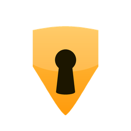

<div align="center">



# Asegurao

### 🔐 Ponle candado a tus apps de Windows

**¿Alguien cotilleando tu Telegram, tus juegos o tus documentos?**
Asegurao **congela** la app al instante y no la suelta hasta que pongas la contraseña.


**[⬇️ Descargar](../../releases/latest)** · **[🇬🇧 English](#-english)**

</div>

---

## 🤔 ¿Qué hace?

1. 🎯 Eliges qué apps proteger.
2. 🧊 Alguien las abre → Asegurao las **congela** en el acto.
3. 🔑 Aparece una ventanita pidiendo la contraseña.
4. ✅ ¿Acierta? La app **sigue justo donde estaba**. ❌ ¿Falla? Se cierra y queda registrado.

Sin pantallas negras, sin cerrar tu trabajo, sin dramas. Ligerísimo: **instalador de ~2 MB**.

## ✨ Características

| | |
|---|---|
| 🔑 **Contraseña maestra** | PIN (mín. 4 dígitos) o contraseña, guardada con **Argon2id**. Nunca en texto plano. |
| 🗝️ **Clave por app** | Cada app con su propia clave, o reutiliza la maestra. |
| 🧊 **Congela, no mata** | Suspende el proceso: al desbloquear, todo sigue como lo dejaste. |
| ⏱️ **Tiempo de confianza** | Tras desbloquear, no vuelve a preguntar durante 5 / 15 / 60 min. |
| 🌙 **Apps de la bandeja** | Telegram, Discord…: al esconderlas en la bandeja, vuelven a pedir la clave cuando reaparecen. |
| 🚷 **Imposible de cerrar** | "Finalizar tarea" y `taskkill` dan *Acceso denegado*. Se cierra solo desde Ajustes, con tu clave. |
| 🕵️ **Pilla las copias** | Copiar el `.exe` y cambiarle el nombre no sirve: lo reconoce igual. |
| 📜 **Historial** | Quién intentó abrir qué, cuándo, y si acertó o no. |
| 📸 **Foto del intruso** | Opcional: foto con la webcam tras varios fallos. 😏 |
| ➕ **Añadir apps fácil** | Desde las instaladas, las abiertas ahora o cualquier `.exe`. |
| 🎨 **3 temas** | Grafito, Bóveda y Aurora. |
| 🛡️ **Nivel Fortaleza** | Quitar protección, cambiar la clave o desinstalar pide **también** tu contraseña de Windows (UAC). |
| 🚫 **Desinstalar protegido** | El desinstalador exige la contraseña maestra. |
| 🔄 **Se actualiza solo** | Actualizaciones firmadas desde Ajustes, con un clic. |
| 🪶 **Discreto** | Vive en la bandeja del sistema y arranca con Windows. |

## ⬇️ Instalación

1. Descarga **`Asegurao_x.x.x_x64-setup.exe`** desde [Releases](../../releases/latest).
2. Instálalo y sigue el asistente: creas tu contraseña maestra y eliges las apps.
3. Listo. Asegurao se queda vigilando en la bandeja. 🛡️

> ⚠️ **Aviso de Windows:** al ser un `.exe` sin firmar que controla otros procesos,
> SmartScreen puede decir *"Windows protegió su PC"* → **Más información** →
> **Ejecutar de todas formas**. Es normal en este tipo de software.

## 🔒 Hasta dónde protege (siendo sinceros)

Asegurao frena de sobra a cualquiera que use tu ordenador de forma normal:
**hermanos, hijos, compañeros de piso, el curioso de turno**. 👀 Ni siquiera
pueden cerrarlo desde el Administrador de tareas.

Lo que **ningún** programa puede impedir por sí solo es que alguien que **sea
administrador**, **sepa tu contraseña de Windows** y tenga conocimientos avanzados
arranque desde un USB o saque el disco. Para eso, la defensa real es
**BitLocker + contraseña de BIOS**. Quien te prometa "imposible de saltar" sin eso, miente.

## 🛠️ Desarrollo

```bash
npm install
npm run tauri dev      # o doble clic en start.bat
npm run tauri build    # o doble clic en deploy.bat → deploy-hosting/
```

**Stack:** Tauri 2 · Rust · Svelte 5 · Vite

---

<div align="center">

# 🇬🇧 English

### 🔐 Lock your Windows apps with a password

</div>

**Someone snooping on your Telegram, games or documents?**
Asegurao **freezes** the app instantly and won't let go until the password is entered.

## 🤔 How it works

1. 🎯 Pick the apps you want to protect.
2. 🧊 Someone opens one → Asegurao **freezes** it on the spot.
3. 🔑 A small window asks for the password.
4. ✅ Correct? The app **resumes right where it was**. ❌ Wrong? It's closed and logged.

No black screens, no lost work. Super light: **~2 MB installer**.

## ✨ Features

- 🔑 **Master password**: PIN (min. 4 digits) or password, stored with **Argon2id**.
- 🗝️ **Per-app password**, or reuse the master one.
- 🧊 **Freezes, doesn't kill**: unlock and everything is as you left it.
- ⏱️ **Trust window**: no re-prompt for 5 / 15 / 60 min after unlocking.
- 🌙 **Tray apps** (Telegram, Discord…) ask again when they come back from the tray.
- 🚷 **Can't be killed**: "End task" and `taskkill` get *Access denied*; quit only from Settings with your password.
- 🕵️ **Catches renamed copies** of a locked `.exe`.
- 🔄 **Signed auto-updates** from Settings.
- 📜 **History** of every attempt.
- 📸 Optional **intruder photo** (webcam) after several failures. 😏
- ➕ **Add apps** from installed ones, running ones, or any `.exe`.
- 🎨 **3 themes**: Grafito, Bóveda, Aurora.
- 🛡️ **Fortress level**: weakening protection or uninstalling also requires your Windows password (UAC).
- 🚫 **Protected uninstall**: the uninstaller asks for the master password.
- 🪶 Lives in the **system tray** and starts with Windows.

## ⬇️ Install

Download **`Asegurao_x.x.x_x64-setup.exe`** from [Releases](../../releases/latest),
run it and follow the wizard. If SmartScreen complains (unsigned app), click
**More info** → **Run anyway**.

## 🔒 How far it protects (honestly)

It easily stops anyone using your PC normally — they can't even close it from
Task Manager. What **no** app alone can stop is an
**administrator who knows your Windows password** booting from USB or pulling the
drive — only **BitLocker + a BIOS password** defends against that.

## 🛠️ Development

```bash
npm install
npm run tauri dev
npm run tauri build
```

---

<div align="center">

Basado en / Based on [AppLocker](https://github.com/Hachiiki/AppLocker) · MIT

Hecho con 🧡 por **Poxi**

</div>
